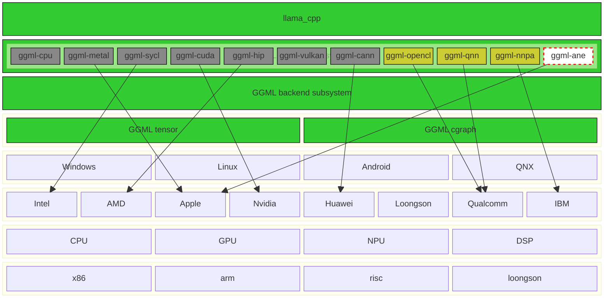
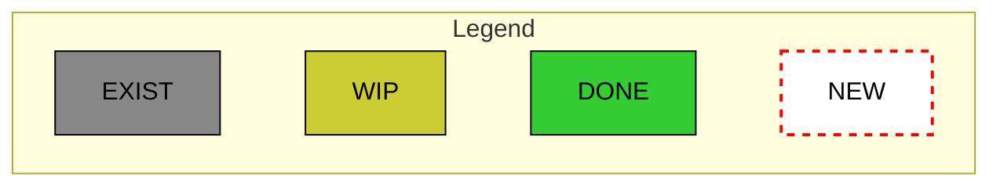

# llama.cpp for QNN(aka ggml-qnn)

- [Background](#background)
- [News](#news)
- [OS](#os)
- [Hardware](#hardware)
- [Android](#android)
- [Windows over ARM](#windows)
- [Q&A](#qa)
- [TODO](#todo)

## Background

Android maintained its position as the leading mobile operating system worldwide in the fourth quarter of 2023 with <b><a  href="https://www.statista.com/statistics/272698/global-market-share-held-by-mobile-operating-systems-since-2009/">a market share of 70.1 percent </a></b> . Qualcomm is No.1 mobile SoC semiconductor company in our planet currently.


**QNN**(Qualcomm Neural Network, aka Qualcomm AI Engine Direct) SDK is verified to work with the following versions of the ML frameworks:

<ul>
<li>TensorFlow: tf-1.15.0, or tf-2.10.1 </li>
<li>TFLite: tflite-2.3.0 </li>
<li> PyTorch: torch-1.13.1</li>
<li> ONNX: onnx-1.11.0 </li>
</ul>


The Qualcomm® AI Engine Direct architecture is designed to be modular and allows for clean separation in the software for different hardware cores/accelerators such as the CPU, GPU and DSP that are designated as backends. Learn more about Qualcomm® AI Engine Direct backends here.


The Qualcomm® AI Engine Direct backends for different hardware cores/accelerators are compiled into individual core-specific libraries that come packaged with the SDK.


One of the key highlights of Qualcomm® AI Engine Direct is that it provides a unified API to delegate operations such as graph creation and execution across all hardware accelerator backends. This allows users to treat Qualcomm® AI Engine Direct as a hardware abstraction API and port applications easily to different cores.


The Qualcomm® AI Engine Direct API is designed to support an efficient execution model with capabilities such as graph optimizations to be taken care of internally. At the same time however, it leaves out broader functionality such as model parsing and network partitioning to higher level frameworks.

Qualcomm® AI Engine Direct API and the associated software stack provides all the constructs required by an application to construct, optimize and execute network models on the desired hardware accelerator core. Key constructs are illustrated by the Qualcomm AI Engine Direct Components - High Level View diagram.


### Llama.cpp + QNN

The llama.cpp QNN backend(aka ggml-qnn backend) is intented to support **Qualcomm mobile SoC** firstly, supported chipsets:

    Snapdragon 8 Gen 1
    Snapdragon 8 Gen 1+
    Snapdragon 8 Gen 2
    Snapdragon 8 Gen 3
    Snapdragon 8 Elite(aka  Snapdragon 8 Gen 4)






## News

- 01/29/2025---03/11/2025
  - re-launch activity of "Refine ggml-qnn backend(QNN, Qualcomm Neural Network,aka Qualcomm AI Engine Direct) for latest ggml,whisper.cpp,llama.cpp"
  - data path works pretty good as expected with whisper.cpp and llama.cpp and test-backend-ops and llama-cli with ggml-qnn backend and verified on Xiaomi14(high-end Qualcomm mobile SoC equipped Android phone)
  - support quantize type mulmat
  - more feature, more UT, more CT, bugfix, santiy check, code refine, refine code format according to coding stye and principle of upstream ggml community
  - support OPs
    - GGML_OP_ADD/GGML_OP_SUB/GGML_OP_MUL/GGML_OP_DIV/GGML_OP_LOG/GGML_OP_SQRT/GGML_OP_MUL_MAT
  - submit the second formal PR to upstream(broken and polluted, now already deprecated)
  - submit the third formal PR to upstream llama.cpp community:["Refine ggml-qnn backend(QNN, Qualcomm Neural Network,aka Qualcomm AI Engine Direct) for latest ggml,whisper.cpp,llama.cpp"](https://github.com/ggml-org/llama.cpp/pull/12326)


- 05/28/2024---06/15/2024
  - re-launch activity of <a href="https://github.com/ggerganov/llama.cpp/pull/6869">PR in upstream ggml community</a>

- 04/26/2024
  - refine PR according to coding stye and pricinples of upstream ggml community
  - add command line test using <a href="https://github.com/ggerganov/llama.cpp/blob/master/tests/test-backend-ops.cpp">test-backend-ops.cpp</a>
  - refine PR according to comments from reviewer

- 04/24/2024
  - the first formal (a very beginning) PR <a href="https://github.com/ggerganov/llama.cpp/pull/6869"> to upstream llama.cpp community</a>
  - data path works fine as expected by <a href="https://github.com/ggerganov/llama.cpp/pull/7641">a workaround approach which not accepted by the author of ggml backend subsystem</a> with whisper.cpp and llama.cpp using QNN backend and verified on both low-end and high-end Android phones based on Qualcomm mobile SoC
  - Support OPs
    - GGML_OP_ADD
    - GGML_OP_MUL
    - GGML_OP_MUL_MAT

 - 03/29/2024---04/24/2024
   - first implementation of ggml-qnn <a href="https://github.com/zhouwg/kantv/issues/121">PoC:add QNN backend for Qualcomm mobile SoC</a>
   

 - 03/25/2024
   - https://github.com/ggml-org/ggml/issues/771
 - 03/05/2024---03/16/2024
   - first touch with ggml <a href="https://github.com/zhouwg/kantv/issues/64">PoC:clean-room implementation of real-time AI subtitle for English online-TV(OTT TV)</a>

## OS

| OS                | Status  | Verified                           |
|-------------------|---------|------------------------------------|
| Android           | Support | Android 10, Android 14             |
| Windows over ARM  | TBD     | TBD                                |


## Hardware

### Qualcomm mobile SoC based Android phone

**Verified devices**

| Qualcom mobile SoC                      | Status  | Verified Vendor                       |
|-----------------------------------------|---------|---------------------------------------|
| Qualcomm SM8650-AB Snapdragon 8 Gen 3   | Support | Xiaomi 14                             |
| Qualcomm low-end mobile SoC Series      | Support | Vivo                                  |

### Windows on ARM(Qualcomm desktop SoC)

a Snapdragon desktop SoC equipped WoA device(Windows on ARM)  is required to **verify build result or further dev activity for WoA(Windows on ARM)**, unfortunately, I have no such WoA device. accordingly, there are might-be some minor issues on WoA(Windows on ARM). the good news for WoA port is:
- a Snapdragon 8gen2 or 8gen3 or 8gen4 equipped Android phone can be seen or bought everywhere, I or this great tech community will finish the major work of ggml-qnn on Snapdragon high-end mobile SoC equipped Android phone.
- the WoA port is an easy thing for a skilled Windows programmer because the highly-well designed Qualcomm QNN SDK and the source codes of ggml/llama.cpp are both highly portable.

## Android

### How to build ggml‐qnn source code for Android and verify ggml-qnn backend on Snapdragon based phone

Ubuntu 20.04,22.04 is validated and recommended as host machine(other Linux distributions might be also ok). the dev activity in this PR can be done in pure command line without any IDE:
  - utilize build-run-android.sh to download Android NDK and Qualcomm QNN SDK automatically(pls see below section)
  - you will need an Android smartphone with adb-connected running on one of below Qualcomm SoCs:

    SM8450    (Snapdragon 8 Gen 1+)
    SM8550    (Snapdragon 8 Gen 2)
    SM8650    (Snapdragon 8 Gen 3)
    SM8750-AB (Snapdragon 8 Elite)(aka  Snapdragon 8 Gen 4)


```
  git clone https://github.com/kantv-ai/ggml-qnn
  cd ggml-qnn
  git checkout pr_to_upstream

 ./scripts/build-run-android.sh
Usage:
  ./scripts/build-run-android.sh help
  ./scripts/build-run-android.sh print_oplist
  ./scripts/build-run-android.sh build
  ./scripts/build-run-android.sh updateqnnlib
  ./scripts/build-run-android.sh run_testops
  ./scripts/build-run-android.sh run_llamacli
  ./scripts/build-run-android.sh run_llamabench

```

we can find that this backend works fine as expected from the log output of "adb logcat | grep ggml-qnn". for programmers, we can use "adb logcat | grep ggml-qnn" to help troubleshooting work.

<!--
###  Run ggml-qnn backend in Android APK on Android phone


-->

## ggml-qnn for WoA(Windows on ARM)

 before build, we should modify file <llama.cpp_src_path>/cmake/arm64-windows-llvm.camke manually(this modification will bring side-effect to other build so we should modify it manually):


- download and install Qualcomm QNN SDK on Windows accordingly from https://www.qualcomm.com/developer/software/qualcomm-ai-engine-direct-sdk, put them in C:\qairt\2.32.0.250228 (as of 03/10/2025, the latest QNN SDK is 2.32.0.250228, pls modify this accordingly)
 - download the customized/dedicated toolchain llvm-mingw-20250305-ggml-ucrt-x86_64.zip (less then 300M) from https://github.com/kantv-ai/toolchain and unzip it to C:\\Program Files\\llvm-mingw-20250305-ggml-ucrt-x86_64\\

open a **Windows command line prompt**
```
set PATH=C:\Program Files\llvm-mingw-20250305-ggml-ucrt-x86_64\bin;C:\Program Files\llvm-mingw-20250305-ggml-ucrt-x86_64\Git\cmd;C:\Program Files\llvm-mingw-20250305-ggml-ucrt-x86_64\CMake\bin;%PATH%;
```

```
git clone https://github.com/kantv-ai/ggml-qnn
cd ggml-qnn
git checkout pr_to_upstream
cd pr_to_upstream
cmake --preset arm64-windows-llvm-release -D GGML_OPENMP=OFF -DGGML_QNN=ON -DCMAKE_CXX_FLAGS=-D_WIN32_WINNT=0x602 -DGGML_QNN_SDK_PATH="C:\\qairt\\2.32.0.250228"
cmake --build build-arm64-windows-llvm-release
```


## Q&A

pls file issue reports on https://github.com/kantv-ai/ggml-qnn/discussions

### **GitHub contribution**:
Please add the **[ggml-qnn]** prefix/tag in discussions/PRs titles to help me check/address them without delay.
